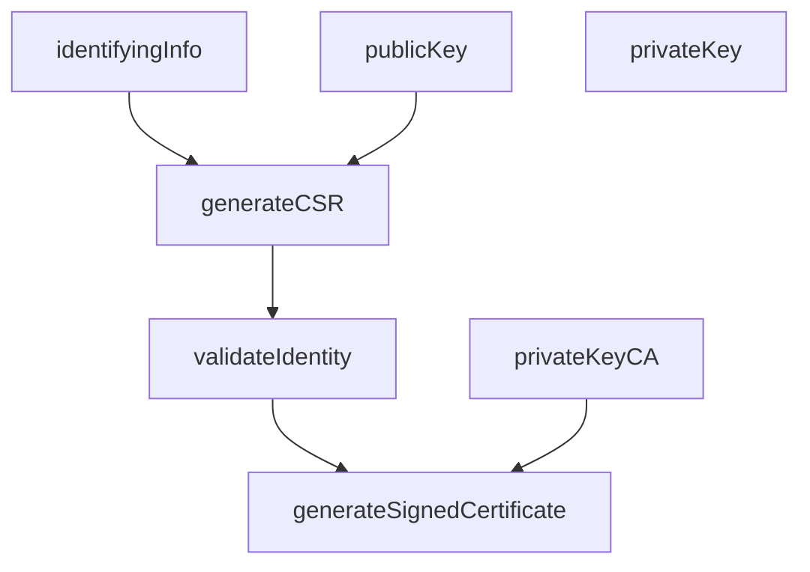
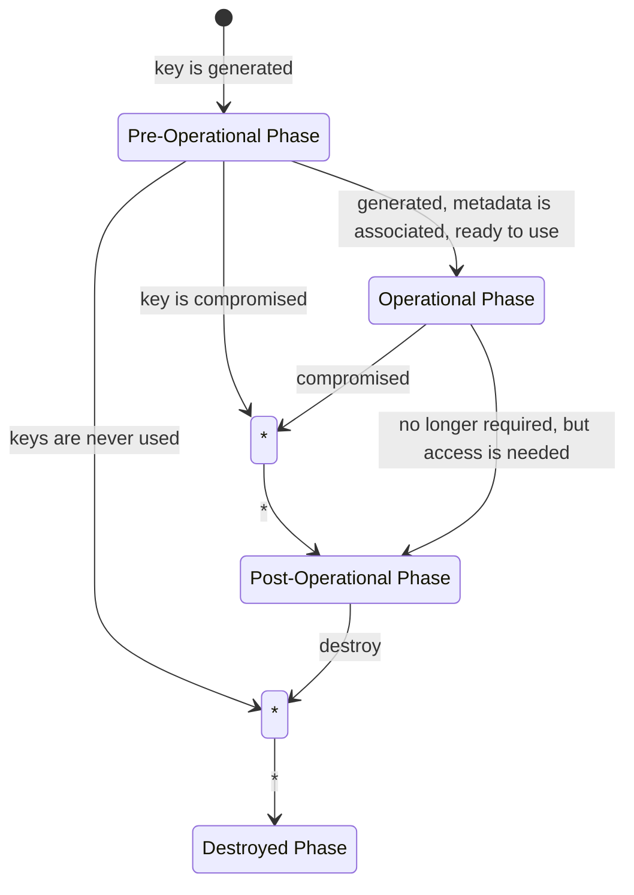

*This page is current as of NIST 800-57, Revision 5.*

***

# The Algorithms

Before continuing, it should go without saying that the algorithms employed in *any* cryptographic application that aims for FIPS-certification should be FIPS-approved or NIST-recommended.

The following subheaders touch on the following families of approved or recommended algorithms for use in cryptography that are given special focus. Generally speaking, the recommended use of these algorithms is discussed at length in NIST SP 800-175B.
* Hash functions
* Symmetric key algorithms
* Asymmetric key algorithms (ECDSA)
* Random bit generators

## Hash Functions

There are three documents specifying FIPS-approved algorithms: FIPS 180-4, FIPS 202, and NIST 800-185. In brief, the approved hash functions are:

* SHA-1, SHA-224, SHA-256, SHA-384, SHA-512
* SHA-512/224, SHA-512/256
* SHA-3 (family composed of SHA3-224, SHA3-256, SHA3-384, SHA3-512, SHAKE128, and SHAKE256)
* cSHAKE, KMAC, TupleHash, ParallelHash

For brevity sake, the algorithms are presented without elaboration.

## Symmetric Key Algorithms

There are two documents specifying FIPS-approved symmetric key algorithms: FIPS 197 and FIPS 198. NIST SP 800-175B discusses them at length.

# Cryptography Purposes

Cryptographic keys can serve many purposes. NIST 800-57 identifies five (5):

Service | Purpose
:-|:-
Confidentiality | Encipherment of plaintext
Integrity | Ensuring data has not been modified
Authentication | 
<ol>
<li>Identity authentication: assurance of the identity of someone interacting with the system</li>
<li>Integrity authentication: data has not been modified</li>
<li>Source authentication: verifies the identity of who created or sent information</li>
</ol>

Authorization | Permission to perform an activity
Non-Repudiation | Like signatures on a piece of paper, used to indicate committment to some information.

These cryptographic methods are not exclusive to one another, and sometimes certain cryptographic algorithms can step on one another a bit. A single system may use multiple instances of public key pairs to achieve its security goals. Consider the web of trust approach used by Certificate Authorities (CA)[^1].

Sometimes, security goals might be better suited to non-cryptographic methods. For example, authorization could be achieved via presentation of legal forms of identification, and authentication could be a security guard guarding some locked door to an information system.

# Key Types and Their Use

## The Types

NIST 800-57 identifies a staggering **nineteen (19)** key types! The exact count is bloated a bit since it counts public and private key components for a single purpose separately. An abridged summary will be presented.

There are seven (7) key pairs covered in NIST 800-57, each with their own special purpose.

Asymmetric Key Pair | Description
:-|:-
Signature-verification | A key pair in an asymmetric algorithm used to verify **digital signatures** and support **non-repudiation**.
Authentication | A key pair in an asymmetric algorithm used to provide **identity authentication** and **integrity authentication**.
Public authentication | Asymmetric key pair to provide **assurance of an identity**.
Key-transport | Used to **encrypt other keys**. Provides **integrity protection** in certain algorithms.
Key-agreement | Long-term key pair used to establish symmetric keys.
Ephemeral key-agreement | Long-term key pair used to establish symmetric keys.
Authorization | Used to prove owner's right to privileges via digital signature.

There are also five (5) symmetric key examples in NIST 800-57, usually used in cases of random bit generation, 

Symmetric Key | Description
:-|:-
Data-encryption | Used with symmetric-key algorithms to apply **confidentiality** to data.
Key-wrapping (yes, the full name is "key-wrapping key") | Used to **encrypt other keys**. Some algorithms enable these keys to also provide **integrity protection**.
RNG keys[^2] | Used to generate random numbers. Think of your RNG seed in a program.
Master keys | Used to derive other symmetric keys.
Authorization | Used to prove right to privileges.

A slightly more verbose table, containing all the keys, is included in the [appendix](#key-types-table).

## Domain Parameters

TODO

# The Lifecycle of a Key

A cryptographic key has a lifetime composed of four (4) discrete states.

1. Pre-operational phase: the key is not available for operation. It might not even be generated!
2. Operational phase: the key is available and in use
3. Post-operational phase: the key is no longer in use, but it may still be accessed. Keys are deactivated or considered compromised.
4. Destroyed phase: keys are no longer available. Metadata about them may or may not be kept.

The below figure is an (almost) exact transcription of the state machine in NIST 800-57, Revision 5, page 89.

## Cryptoperiod: The Lifetime of a Key

The **cryptoperiod** of a key is the timespan in which it is authorized for use. This timespan can be affected and defined by more than just "some amount of time", though. Consider: what if we want to **limit the amount of data a key should be used to encrypt in its lifetime**? What if we want to **limit the use of an algorithm**? There are many, many different variables to consider in setting the intended length of a cryptoperiod. NIST 800-57 names forteen (14) major variables, and a slew of other considerations for each of the types named in [The Types](#the-types)! A minimalist subset of these variables is:

* The strength of the algorithm, the key length, the block size, the mode of operation
* How the key is stored. Is it in a FIPS 140 Level 4[^3] module, or just software?
* How often will it be used?
* How long will the data it enciphers be kept? Will that data ever need to be re-enciphered?
* How many copies will be made of the key? How will those copies be transmitted?
* How big of a threat is posed by new technologies or motivated adversaries?

NIST 800-57 provides a few general-case recommendations for cryptoperiods by key type. An abridged table is provided in the [appendix](#suggested-cryptoperiods-by-key-type).

These are all essential questions to bear in mind when setting the cryptoperiod of a key. The most important thing to remember, though, is that **if the key is compromised, then its cryptoperiod immediately ends!**

## Usage: The Life of a Key

NIST 800-57 specifies that, for any one single key, the key shall be used for exactly one purpose. This ensures that exposure of any one given key is limited, and that it isn't retained for a period exceeding the intended period of time in which it is valid.

## Compromise and Retirement: The Death of a Key

Or maybe cremation is more apt.

When a cryptographic key is compromised or needs to be revoked, for whatever reason, it should stop being used **immediately**, unless for certain extremely controlled operations, such as digital signature verification or for re-encipherment of data under a new key. NIST 800-57 recommends that the compromised key "**shall** be limited to processing information that has already been protected", and "the entity that uses the information **must** be made fully aware of the dangers involved" (p. 49).

When revoked, "entities sharing the key need to be notified" (p. 114) in some way. Typically, this is through a key list. Consider [MIT's key server](https://pgp.mit.edu/), which revokes keys via `pgp` revocation message. NIST 800-57 specifies that the notification include all relevant information, such as when the revocation was made.

Following termination of the key, it enters its "destroyed phase", in which it is no longer used for any operations, and may or may not have metadata about it kept for records.

# Choosing Algorithms and Key Sizes

TODO

***

# Appendix

## Key Types Table

# | Key Type | Description
:-:|:-|:-
1 | Private signature keys | private keys of asymmetric algorithms
2 | Public signature-verification key | Public key of an asymmetric algorithm to verify **digital signatures** and support **non-repudiation**.
3 | Symmetric authentication key | Provide **identity authentication** and **integrity authentication**.
4 | Private authentication key | Private key of an asymmetric key pair to provide **assurance of an identity**.
5 | Public authentication key | Public key of an asymmetric key pair to provide **assurance of an identity**.
6 | Symmetric data-encryption key | Used with symmetric-key algorithms to apply **confidentiality** to data.
7 | Symmetric key-wrapping key | Used to **encrypt other keys**. Some algorithms enable these keys to also provide **integrity protection**.
8 | Symmetric RNG keys | Used to generate random numbers.
9 | Symmetric master key | Used to derive other symmetric keys.
10 | Private key-transport key | Used to transport other keys in a PKA.
11 | Public key-transport key | Used to transport other keys in a PKA.
12 | Symmetric key-agreement key | Used to establish symmetric keys
13 | Private static key-agreement key | Long-term private keys of asymmetric key pairs used to establish symmetric keys
14 | Public static key-agreement key | Long-term public keys of an asymmetric key pair used to establish symmetric keys
15 | Private ephemeral key-agreement key | Long-term private keys of asymmetric key pairs used to establish symmetric keys
16 | Public ephemeral key-agreement key | Long-term public keys of asymmetric key pairs used to establish symmetric keys
17 | Symmetric authorization key | Used to provide privileges to an entity using symmetric cryptographic methods.
18 | Private authorization key | Part of an asymmetric key pair used to prove owner's right to privileges via digital signature.
19 | Public authorization key | Part of an asymmetric key pair used to prove owner's right to privileges for an entity that knows their associated private authorization key.

## Suggested Cryptoperiods by Key Type

The below table is a simplified version of NIST 800-57's Table 1, in Section 5.3.6 of Revision 5. There are some details omitted, such as the distinction between "Originator-Usage Period (OUP)" and the "Recipient-Usage Period". The field "Key Type #" corresponds to the key types listed in this page's [Key Types Table](#key-types-table).

Key Type # | Recommended Cryptoperiod
:-:|:-
1 | 1 to 3 years
2 | Some years. Depends on key size.
3 | At the very most: 5 years.
4 | 1 to 2 years
5 | 1 to 2 years
6 | At the very most: 5 years.
7 | At the very most: 5 years.
8 | "Recommended whenever a consuming application and implementation are able to perform this process."[^4]
9 | About 1 year
10 | At most 2 years.
11 | 1 to 2 years.
12 | 1 to 2 years.
13 | 1 to 2 years.
14 | 1 to 2 years.
15 | Should only be used once.
16 | Should only be used once.
17 | At most 2 years.
18 | At most 2 years.
19 | At most 2 years.

[^1]: As pulled from https://www.ssl.com/faqs/what-is-a-certificate-authority/
[^2]: This is one of the very few instances that you will see NIST use the term "random **number**"! Usually, they prefer to use "random bit", as it is more semantically correct.
[^3]: FIPS 140 Level 4 modules are basically locked in an underground room with no windows. See [FIPS 140-3](/cyber/fips/140-3/).
[^4]: Described in [NIST SP 800-90A](/cyber/nist/800-90a/).
