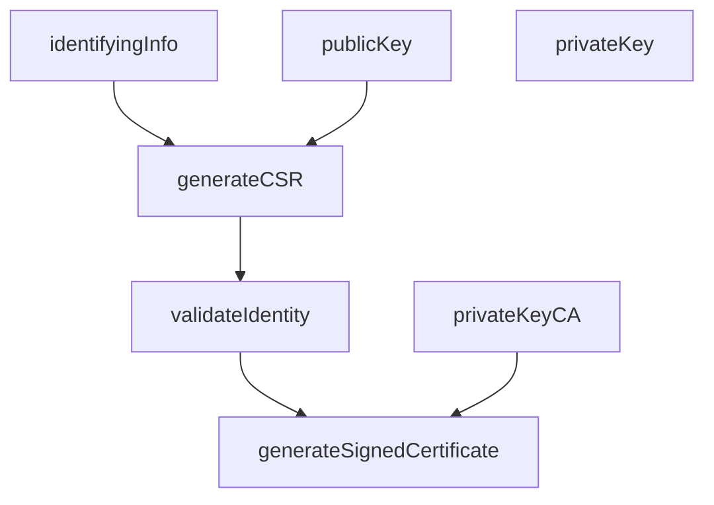

*This page is current as of NIST 800-57, Revision 5.*

***

# The Algorithms

Before continuing, it should go without saying that the algorithms employed in *any* cryptographic application that aims for FIPS-certification should be FIPS-approved or NIST-recommended.

The following subheaders touch on the following families of approved or recommended algorithms for use in cryptography that are given special focus. Generally speaking, the recommended use of these algorithms is discussed at length in NIST SP 800-175B.
* Hash functions
* Symmetric key algorithms
* Asymmetric key algorithms (ECDSA)
* Random bit generators

## Hash Functions

There are three documents specifying FIPS-approved algorithms: FIPS 180-4, FIPS 202, and NIST 800-185. In brief, the approved hash functions are:

* SHA-1, SHA-224, SHA-256, SHA-384, SHA-512
* SHA-512/224, SHA-512/256
* SHA-3 (family composed of SHA3-224, SHA3-256, SHA3-384, SHA3-512, SHAKE128, and SHAKE256)
* cSHAKE, KMAC, TupleHash, ParallelHash

For brevity sake, the algorithms are presented without elaboration.

## Symmetric Key Algorithms

There are two documents specifying FIPS-approved symmetric key algorithms: FIPS 197 and FIPS 198. NIST SP 800-175B discusses them at length.

# Cryptography Purposes

Cryptographic keys can serve many purposes. NIST 800-57 identifies five (5):

Service | Purpose
:-|:-
Confidentiality | Encipherment of plaintext
Integrity | Ensuring data has not been modified
Authentication | 
<ol>
<li>Identity authentication: assurance of the identity of someone interacting with the system</li>
<li>Integrity authentication: data has not been modified</li>
<li>Source authentication: verifies the identity of who created or sent information</li>
</ol>

Authorization | Permission to perform an activity
Non-Repudiation | Like signatures on a piece of paper, used to indicate committment to some information.

These cryptographic methods are not exclusive to one another, and sometimes certain cryptographic algorithms can step on one another a bit. A single system may use multiple instances of public key pairs to achieve its security goals. Consider the web of trust approach used by Certificate Authorities (CA)[^1].

Sometimes, security goals might be better suited to non-cryptographic methods. For example, authorization could be achieved via presentation of legal forms of identification, and authentication could be a security guard guarding some locked door to an information system.

# The Lifetime of a Key

A cryptographic key has a lifetime composed of discrete states.

TODO

[^1]: As pulled from https://www.ssl.com/faqs/what-is-a-certificate-authority/